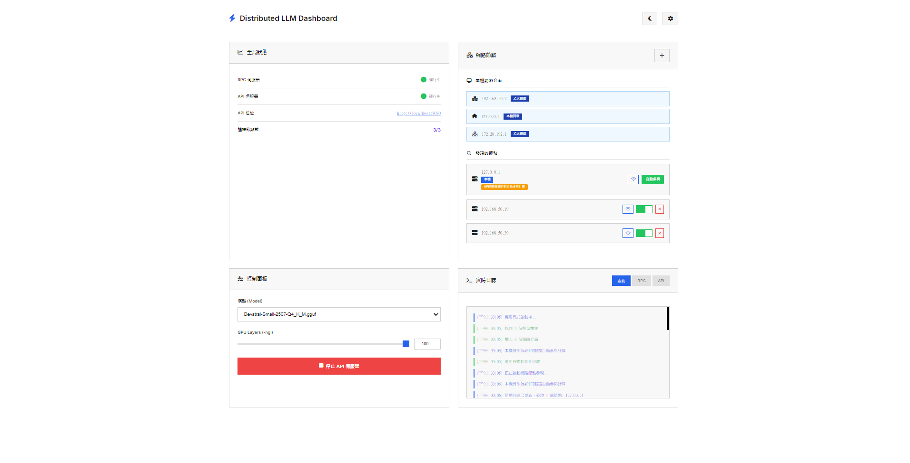

# 分佈式 LLM 推理桌面應用程式

一個基於 [llama.cpp](https://github.com/ggml-org/llama.cpp) 的分佈式 LLM 推理程式，讓您能夠利用區域網路內的多台電腦協同進行大型語言模型的分佈式推理，使用 Electron 的製作跨平台桌面應用程式操作 UI。



## 功能特色

- 🖥️ **現代化介面**: 簡潔專業的深色/明亮模式切換
- 🌐 **智能節點發現**: 自動偵測 + 手動添加，支援定時廣播
- ⚡ **高效分佈式推理**: 本機API伺服器 + 遠程RPC節點協同計算
- 📁 **智能模型管理**: 自動掃描 GGUF 格式模型，支援 GPU 層數調整
- 🔒 **企業級安全**: API Key 保護 + 連接驗證
- 📊 **實時監控**: 多標籤日誌系統，自動滾動，狀態即時更新
- 🔧 **專業工具**: 節點連接檢查、本機IP顯示、手動節點管理
- 🚀 **跨平台**: 支援 Windows、macOS 和 Linux，統一體驗

## 系統需求

- Node.js 18+ 
- 支援的作業系統：Windows 10+、macOS 10.15+、Ubuntu 18.04+
- 至少 8GB RAM（取決於模型大小）
- 可選：NVIDIA GPU（用於 GPU 加速）

## 安裝步驟

### 開發環境

1. **克隆專案**
   ```bash
   git clone <repository-url>
   cd distributed-llm-inference
   ```

2. **安裝依賴**
   ```bash
   npm install
   ```

3. **準備模型檔案**
   - 將 `.gguf` 格式的模型檔案放入 `models/` 資料夾
   - 可從 [Hugging Face](https://huggingface.co/models?library=gguf) 下載

4. **確認二進位檔案**
   - 確保 `bin/` 資料夾包含對應平台的執行檔
   - 檔案需自行至 https://github.com/ggml-org/llama.cpp/releases 下載
   - Windows: `rpc-server.exe`, `llama-server.exe`
   - Linux/macOS: `rpc-server`, `llama-server`

### 生產環境（打包後）

打包後的應用程式結構：
```
app/
├── resources/
│   ├── bin/               # llama.cpp 執行檔
│   │   ├── windows/
│   │   ├── linux/
│   │   └── macos/
│   └── app/
│       ├── src/
│       ├── models/        # 模型資料夾（僅包含 README.md）
│       └── node_modules/
```

**重要說明**：
- 打包時會自動排除 `.gguf` 檔案以減少安裝包大小
- 用戶需要手動將模型檔案放入安裝後的 `models/` 資料夾
- 應用程式會自動檢測並載入 `models/` 資料夾中的 `.gguf` 檔案

## 使用方法

### 開發模式
```bash
npm run dev
```

### 生產模式
```bash
npm start
```

### 打包應用程式
```bash
npm run build
```

## 使用說明

### 🚀 **快速開始**

1. **啟動應用程式**
   - 自動啟動 RPC 伺服器（端口 50052）
   - 顯示本機所有網路介面 IP
   - 開始 mDNS 節點發現（每30秒自動搜尋）

2. **節點管理**
   - **自動發現**: 等待其他節點自動出現
   - **手動添加**: 點擊 "+" 按鈕手動添加節點 IP
   - **連接檢查**: 點擊 WiFi 圖示驗證節點連接
   - **節點選擇**: 使用開關選擇參與計算的遠程節點

3. **模型配置**
   - 從下拉選單選擇 GGUF 模型
   - 調整 GPU 層數滑動條（-ngl 參數）
   - 設定 API Key（可選，用於保護服務）

4. **啟動分散式推理**
   - 點擊「啟動 API 伺服器」
   - 本機自動作為 API 伺服器參與計算
   - 選中的遠程節點作為 RPC 計算節點
   - 服務在 `http://localhost:8080` 啟動

### 📊 **節點架構說明**

```
┌─────────────────┐    ┌─────────────────┐    ┌─────────────────┐
│   本機 (API)    │    │  遠程節點 (RPC) │    │  遠程節點 (RPC) │
│  127.0.0.1      │◄──►│  192.168.1.101  │    │  192.168.1.102  │
│  端口: 8080     │    │  端口: 50052    │    │  端口: 50052    │
│  [自動參與]     │    │  [可選擇]       │    │  [可選擇]       │
└─────────────────┘    └─────────────────┘    └─────────────────┘
```

### 🔧 **進階功能**

#### **主題切換**
- 點擊右上角月亮/太陽圖示
- 支援明亮模式（預設）和深色模式
- 設定自動保存

#### **節點連接檢查**
- 每個節點都有 WiFi 圖示檢查按鈕
- 自動檢查 RPC 服務（端口 50052）
- 顯示連接狀態氣泡提示

#### **實時日誌監控**
- **系統日誌**: 應用程式操作和狀態
- **RPC 日誌**: RPC 伺服器運行日誌  
- **API 日誌**: API 伺服器運行日誌
- 自動滾動到最新訊息

### 🌐 **API 使用**

#### **OpenAI 相容 API**
```bash
curl -X POST http://localhost:8080/v1/chat/completions \
  -H "Content-Type: application/json" \
  -H "Authorization: Bearer YOUR_API_KEY" \
  -d '{
    "model": "gpt-3.5-turbo",
    "messages": [{"role": "user", "content": "Hello!"}],
    "max_tokens": 100,
    "temperature": 0.7
  }'
```

#### **健康檢查**
```bash
curl http://localhost:8080/health
```

#### **模型資訊**
```bash
curl http://localhost:8080/v1/models
```

## 網路設定

### 🔥 **防火牆設定**
確保以下端口開放：
- **50052**: RPC 伺服器通訊端口（必須）
- **8080**: API 伺服器端口（必須）
- **5353**: mDNS 服務發現端口（建議）

### 🌐 **網路需求**
- **同一區域網路**: 所有節點必須在相同網段
- **mDNS 支援**: 大部分家用路由器預設支援
- **穩定連接**: 建議使用有線網路以獲得最佳性能

### 💡 **效能建議**
- **GPU 加速**: 設定適當的 GPU 層數（-ngl）
- **記憶體管理**: 確保每個節點有足夠 RAM
- **網路頻寬**: 節點間通訊需要穩定頻寬
- **負載平衡**: 合理分配計算任務到各節點

## 故障排除

## 🔧 故障排除

### ❓ **常見問題**

#### **1. 節點發現問題**
- **自動發現失敗**: 
  - 檢查防火牆是否開放端口 5353
  - 確認路由器支援 mDNS 廣播
  - 使用手動添加功能作為替代方案
- **節點連接失敗**:
  - 使用連接檢查功能驗證節點狀態
  - 確認目標設備已啟動此程式
  - 檢查網路連通性

#### **2. 模型相關問題**
- **模型載入失敗**:
  - 確認檔案格式為 `.gguf`
  - 檢查檔案完整性和權限
  - 確保有足夠磁碟空間
- **記憶體不足**:
  - 選擇較小的量化模型（如 Q4_K_M）
  - 調整 GPU 層數設定
  - 增加更多節點分散負載

#### **3. 服務啟動問題**
- **API 伺服器啟動失敗**:
  - 檢查端口 8080 是否被佔用
  - 查看 API 日誌獲取詳細錯誤
  - 確認模型檔案路徑正確
- **RPC 伺服器問題**:
  - 檢查端口 50052 是否可用
  - 查看 RPC 日誌排查問題
  - 重新啟動應用程式

#### **4. 效能優化**
- **推理速度慢**:
  - 增加 GPU 層數（如果有 GPU）
  - 添加更多計算節點
  - 使用更快的網路連接
- **網路延遲高**:
  - 使用有線網路連接
  - 確保節點在同一網段
  - 檢查網路頻寬使用情況

### 🔍 **除錯工具**

#### **內建除錯功能**
- **連接檢查**: 點擊 WiFi 圖示測試節點連接
- **實時日誌**: 查看詳細的系統運行日誌
- **狀態監控**: 即時顯示服務器和節點狀態
- **本機IP顯示**: 確認網路配置正確

#### **命令行工具**
```bash
# 檢查端口佔用
netstat -an | grep :8080
netstat -an | grep :50052

# 測試網路連通性
ping 192.168.1.101
telnet 192.168.1.101 50052

# 檢查 mDNS 服務
# Windows: 使用 Bonjour Browser
# macOS: dns-sd -B _llm-cluster._tcp
# Linux: avahi-browse -rt _llm-cluster._tcp
```

### 📋 **日誌系統**
應用程式提供完整的日誌監控：
- **系統日誌**: 節點發現、連接狀態、操作記錄
- **RPC 日誌**: RPC 伺服器啟動、連接、錯誤訊息
- **API 日誌**: API 伺服器運行、請求處理、推理日誌
- **自動滾動**: 新訊息自動滾動到底部
- **顏色區分**: 成功(綠)、錯誤(紅)、資訊(藍)

### 🎯 **最佳實踐**

#### **部署建議**
1. **網路規劃**: 使用千兆乙太網路連接所有節點
2. **硬體配置**: 確保每個節點有足夠的 RAM 和 GPU
3. **模型選擇**: 根據總記憶體選擇合適的模型大小
4. **負載測試**: 使用少量節點測試後再擴展

#### **安全建議**
1. **API Key**: 在生產環境中務必設定 API Key
2. **網路隔離**: 在專用網段運行分散式推理
3. **存取控制**: 限制 API 伺服器的存取來源
4. **監控**: 定期檢查節點狀態和日誌

#### **維護建議**
1. **定期更新**: 保持應用程式和模型的最新版本
2. **備份配置**: 備份重要的設定和 API Key
3. **效能監控**: 關注記憶體使用和網路流量
4. **故障恢復**: 準備節點故障的應對方案

## 技術架構

- **前端**: HTML + CSS + JavaScript
- **後端**: Electron (Node.js)
- **推理引擎**: llama.cpp
- **服務發現**: mDNS (bonjour-service)
- **設定儲存**: electron-store

## 開發

### 專案結構
```
├── src/
│   ├── main/           # Electron 主進程
│   ├── preload/        # 預載腳本
│   └── renderer/       # 前端介面
├── bin/                # llama.cpp 二進位檔
├── models/             # 模型檔案
└── package.json
```

### 貢獻指南
1. Fork 專案
2. 創建功能分支
3. 提交變更
4. 發送 Pull Request

## 授權

Apache 2.0 License

## 支援

如有問題或建議，請提交 Issue 或聯繫開發團隊。